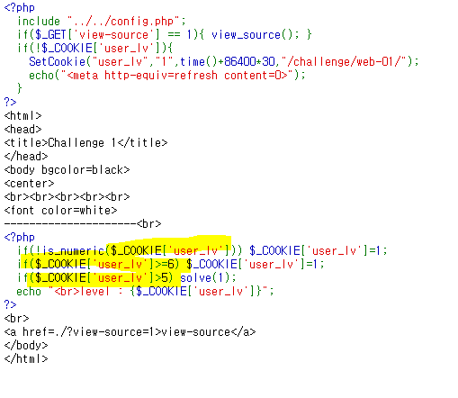

# Webhacking.kr 문제 풀이

## Lv. 1

보는 것과 같은 힌트를 주는데, 저기서 저 부분에 집중을 함.

$_COOKIE 라는거 자체가 사이트의 쿠키였는데, 이 문제는,

**<u>쿠키변조 문제</u>**라는 것을 판단할 수 있음.

https://gocoder.tistory.com/105

위의 사이트에서 대부분 참조를 함. EditThisCookie 플러그인을 설치하고 쿠키를 변조 함

하지만 쿠키를 아무렇게나 변조하면 안됨. 만약 쿠키가 6보다 큰 경우에는 다시 쿠키를 1로 만들어 버리기 때문임.

5보다 크면 solve가 되는 걸로 되지만 6보다 같거나 크면 그 전에 1로 만들기 때문에 5이상 6미만의 수를 넣으면 됨.

그래서 5.1을 넣고 공격을 시도했더니 성공함.

